# Heart Health EDA in R by Justin Carlou Lim (July 9, 2025)

This project explores and analyzes the Heart Health Dataset found at the following:
https://www.kaggle.com/datasets/mahad049/heart-health-stats-dataset

Main Question: What factors affect risk of hypertension?
* What is the effect of BMI on increased blood pressure? What about smoking? gender?
* Is there a relationship between hypertension and cholesterol? high-glucose levels (potentially, with relationship to type 2 diabetes)?

### Table of Contents ###
  1. Data Wrangling
  2. BMI and Hypertension
  3. Smoking, Gender, and Hypertension
  4. Cholesterol, Glucose Levels, and Hypertension
  5. Conclusion
  6. References

## Data Wrangling
First, I reworked the dataset so it'd be more usable for my analyses. 
* Checked for NA values. There were one, and this may be because this is a synthetic dataset used for illustrative purposes.
* Changed Smoker and Gender column data from character to factor.
* Separate character variable "Blood.Pressure.mmHg." to systolic and diastolic blood pressure. Then, convert to numeric.
* Separate entries by blood pressure categories as described in American Heart Association chart (attached in images folder). However, most entries' BMI fall between 20-30, so that is what is graphed.
* Calculate BMI using Height (converted to m) and Weight (kg). Create categories based on the chart from the Center for Disease Control (attached in images). 
* Create separate datasets for Smoker/Nonsmoker and Male/Female.

The cleaning process is documented in the code. 

## BMI and Hypertension
Next, I decided to look at the relationship between BMI and Hypertension using the BMI ranges created from the data wrangling process.

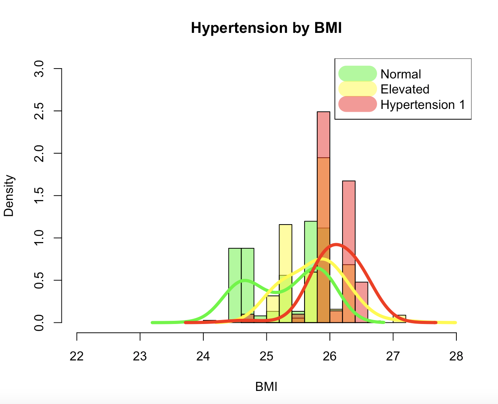

In our dataset, I decided to omit the variables "Hypertension 2" and "Hypertension Crisis" because no values fell under these categories. From the chart, we see that the the peak density for those with higher blood pressure readings increases as BMI increases. Thus, we can work with the assumption that there is a positive correlation between BMI and high blood pressure. 

## Smoking, Gender, and Hypertension

Moving on, I attempt to analyze the effects of Smoking and Hypertension, and any variability in Hypertension and Gender

### Smokers and Hypertension
From quick observation, we have roughly the same amount of smokers and non-smokers in our dataset. 

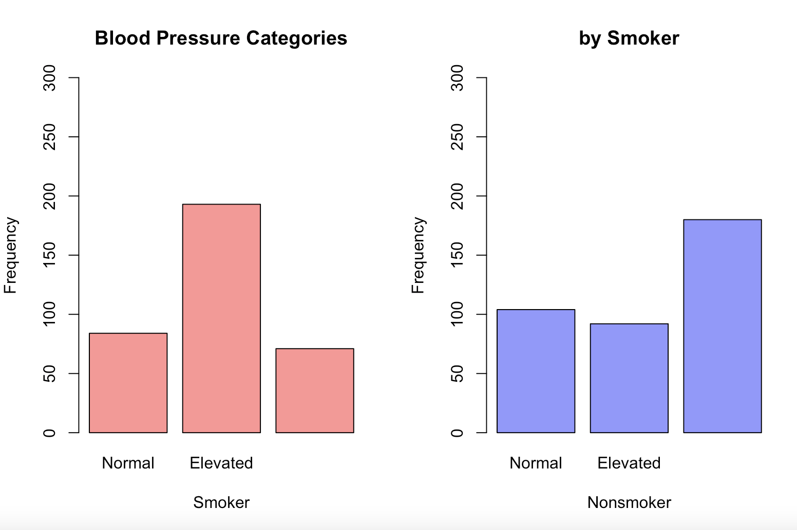

Interestingly, I found that Hypertension 1 is way higher in Non-smokers than in Smokers for this dataset. This was unexpected, so I decided to look at the BMI distribution for the two categories to see if this was causing some interferece. 

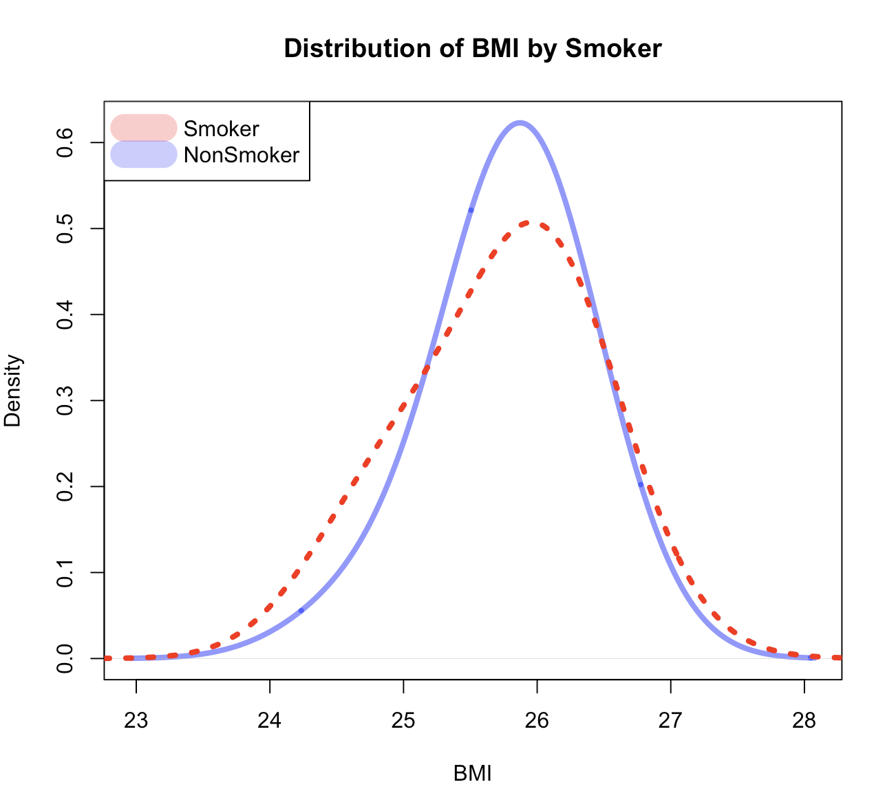

From the graph, it seems that Smoking and Non-Smoking have Similar BMI distributions. Smokers have slightly higher BMI measurements, but this does not explain why the Non-smokers in our dataset have higher rates of Hypertension.

From some quick table readings, we see that our Smoker data has more Male participants and vice versa for Nonsmokers. This raises the question: do Females have higher rates of Hypertension than Males?

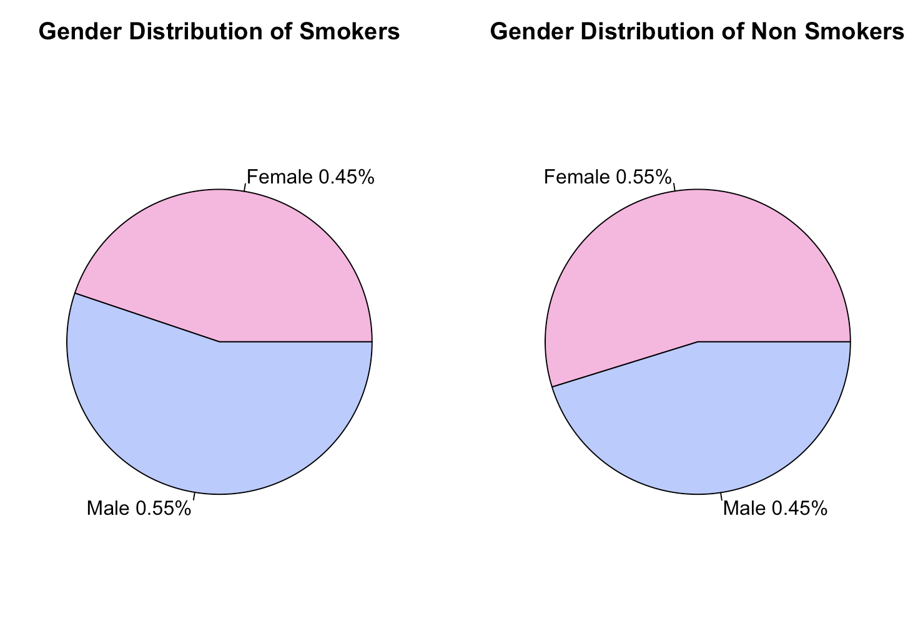

Note: It is still worth mentioning, our smoker table shows more elevated Blood Pressure than non-smokers. 

### Gender 

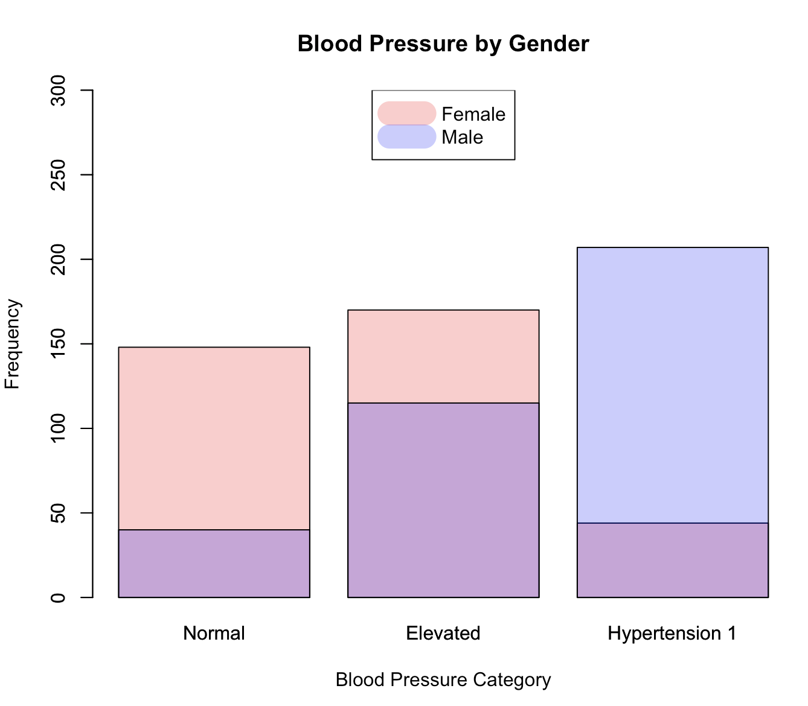

Looking specifically at gender and hypertension, I notice hypertension is way higher in Males than in Females. This still leaves an enigma in the relationship between smoking and hypertension, so next I analyze all 3 factors together. 

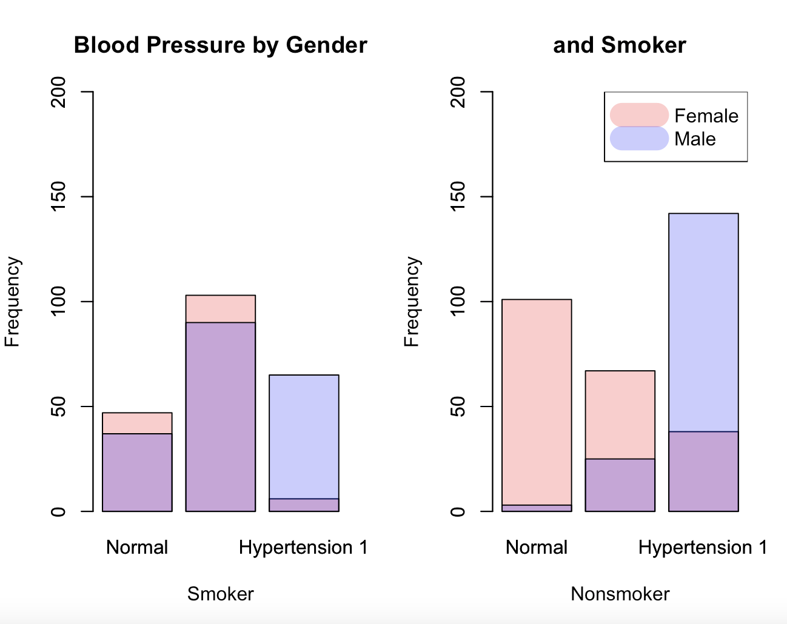

From our graphs, the value of Hypertension 1 in our Nonsmoker category is due to the overwhelming amount of Males with Hypertension. This is what I was seeing in our previous graph.
These graphs prove that males have higher Blood Pressure readings than females. Yet, the effect of smoking is still undetermined.

### BMI, Smoking, and Gender

Thus, in the effort of cohesion, I attempt to analyze the cross-relationship between all 3 variables. 

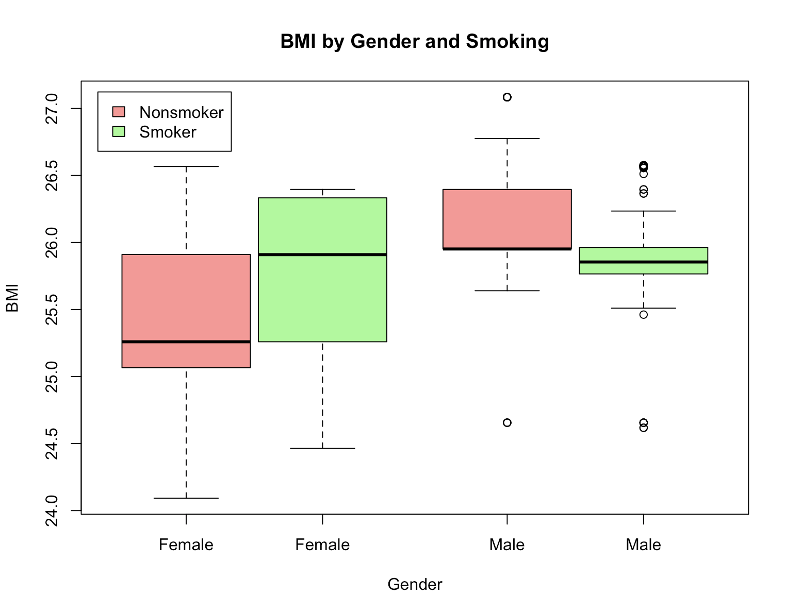

From the boxplot, we can see that Gender has a stronger relationship to blood pressure than smoking does-- with males having higher BMI's than females. Following, smokers in the female category tend to have higher BMIs while males have roughly the same BMI for both smokers and nonsmokers. 

With the context of BMI having a positive relationship to Blood Pressure, my inference that Gender has a positive relationship to Blood Pressure-- most likely due to differing habits between genders-- still holds true. The undetermined relationship between smoking and Blood Pressure also still holds true. 

## Cholesterol, Glucose Levels, and Hypertension

Next, I attempt to find patterns between Cholesterol, Glucose levels, and Hypertension given what I've learned in the above analyses. 

Note: I considered plotting cholesterol and glucose patterns together, but seeing that there range and spread are on different scales, I felt plotting them together would be misleading. 

### Cholesterol and Hypertension

Looking first at Cholesterol and what we know about BMI and Hypertension, 

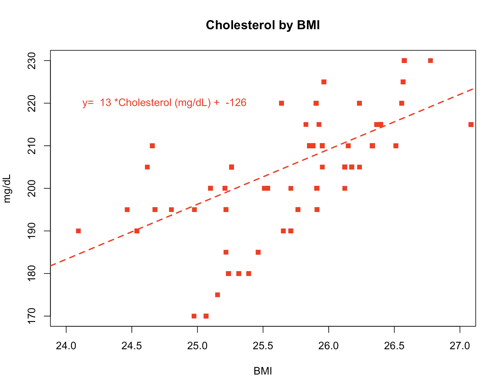

From our graph, we notice that there is a strong positive correlation between BMI and cholesterol, with a regression equation of y= 13*Cholesterol(mg/dL) - 126. From this, we can safely assume that risk of hypertension can increase with heightened cholesterol. 

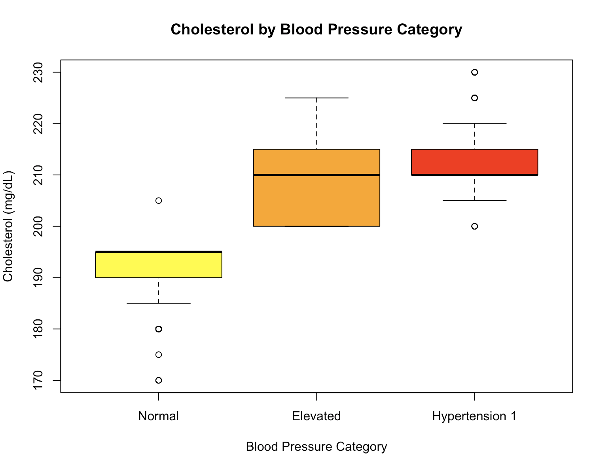

From the box plot, we can see clearly that higher cholesterol levels have a positive relationship to hypertension, which is consistent with BMI's relationship to Cholesterol and Blood Pressure.

### Glucose Levels annd Hypertension
Moving on to Glucose Levels, 

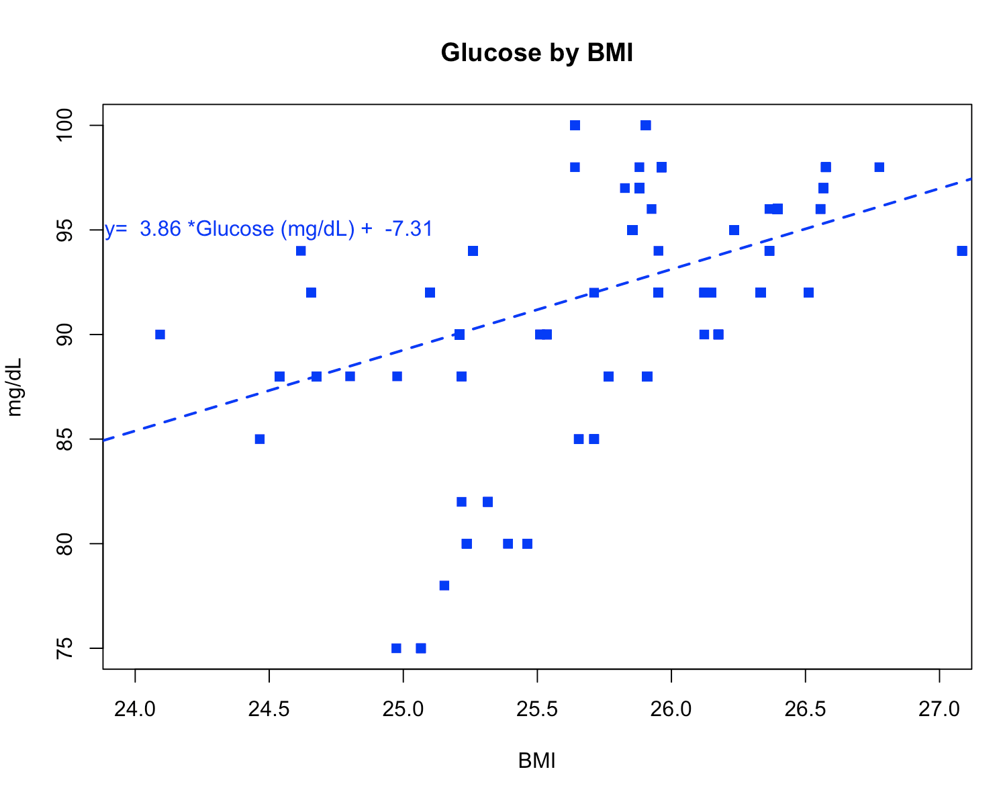

We notice that there is a slight positive correlation between BMI and glucose levels, with a regression equation of y= 3.86*Glucose(mg/dL) - 7.31. With this in mind, we can also safely assume heightened glucose levels may lead to risk of hypertension. Making the same box plot for glucose levels,

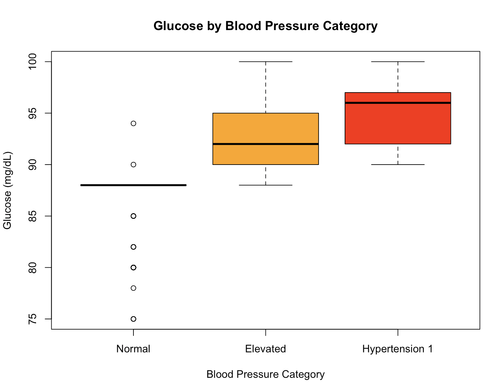

Similarly, elevated blood pressure and hypertension 1 are consistent with high glucose levels. Yet, the relationship is not as clear as the relationship to cholesterol. 

This can be read as a lack of separation between glucose levels and the range between elevated blood pressure to hypertension 1.It is worth noting that glucose levels within the normal blood pressure category are at a wide range to 94. Thus, higher blood pressure ratings can be predicted only past Glucose levels of 94+.

In conclusion, though Glucose has a positive relationship to BMI, it is not a good indicator of hypertension. 

## Conclusion

From our exploration of the dataset we found that:
* BMI: Blood Pressure has a positive relationship with BMI, meaning I found that it BP increases as BMI increases.
* Gender: In our dataset, Males have a higher risk of elevated blood pressure and hypertension 1 than females.
* Smoking: The effect of smoking on blood pressure is undetermined, the results of our analysis don't confirm a positive nor negative relationship between smoking and blood pressure.
* Cholesterol: Cholesterol has a positive linear effect on BMI. In tandem with what we learned about BMI, it also has a positive relationship to Hypertension.
* Glucose: Though Glucose has a positive linear relationship to BMI, it was found not to be a good predictor of Hypertension. However, glucose levels past 94mg/dL are related to higher blood pressure readings. 

## References

Mahad, Muhammad. (July,2024). Heart Health Stats Dataset, Version 1. Retrieved July, 20024 from    
  (https://www.kaggle.com/datasets/mahad049/heart-health-stats-dataset).
  
(March, 2024). BMI categories for adults 20 and older [Online Image]. U.S. Centers for Disease Control and Prevention. Retrieved July, 2024   from (https://www.cdc.gov/bmi/adult-calculator/bmi-categories.html)

(May, 2024). Blood Pressure Chart [Online image]. American Heart Association. Retrieved July, 2024 from 
  (https://www.heart.org/en/health-topics/high-blood-pressure/understanding-blood-pressure-readings). 

