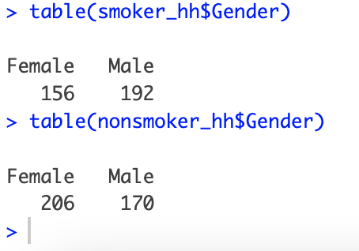

# Heart Health EDA in R by Justin Carlou Lim (July 9, 20250

This project explores and analyzes the Heart Health Dataset found at the following:
https://www.kaggle.com/datasets/mahad049/heart-health-stats-dataset

Main Question: How does bmi affect risk of hypertension?
* What about by gender?
* What about smoking?

### Table of Contents ###
  1. Data Wrangling
  2. BMI and Hypertension
  3. Smoking, Gender and Hypertension
  4. Findings

## Data Wrangling
First, I reworked the dataset so it'd be more usable for my analyses. 
* Changed Smoker and Gender column data from character to factor.
* Separate character variable "Blood.Pressure.mmHg." to systolic and diastolic blood pressure. Then, convert to numeric.
* Separate entries by blood pressure categories as described in American Heart Association chart (attached in images folder).
* Calculate BMI using Height (converted to m) and Weight (kg). Create categories based on the chart from the Center for Disease Control (attached in images). 
* Create separate datasets for Smoker/Nonsmoker and Male/Female.

The cleaning process is documented in the code. 

## BMI and Hypertension
Next, I decided to look at the relationship between BMI and Hypertension using the BMI ranges created from the data wrangling process.

In our dataset, I decided to omit the variables "Hypertension 2" and "Hypertension Crisis" because no values fell under these categories. From the chart, we see that the the peak density for those with higher blood pressure readings increases as BMI increases. Thus, we can work with the assumption that there is a positive correlation between BMI and high blood pressure. 

## Smoking, Gender, and Hypertension

### Smokers and Hypertension
From quick observation, we have roughly the same amount of smokers and non-smokers in our dataset. 

Interestingly, I found that Hypertension 1 is way higher in Non-smokers than in Smokers for this dataset. This was unexpected, so I decided to look at the BMI distribution for the two categories to see if this was causing some interferece. 

From the graph, it seems that Smoking and Non-Smoking have Similar BMI distributions. Smokers have slightly higher BMI measurements, but this does not explain why the Non-smokers in our dataset have higher rates of Hypertension.

From some quick table readings, we see that our Smoker data has more Male participants and vice versa for Nonsmokers. This raises the question: do Females have higher rates of Hypertension than Males?

Note: It is still worth mentioning, our smoker table shows more elevated Blood Pressure than non-smokers. 

### Gender 

Looking specifically at gender and hypertension, I notice hypertension is way higher in Males than in Females. This still leaves an enigma in the relationship between smoking and hypertension, so next I analyze all 3 factors together. 

From our graphs, the value of Hypertension 1 in our Nonsmoker category is due to the overwhelming amount of Males with Hypertension. This is what I was seeing in our previous graph.
These graphs prove that males have higher Blood Pressure readings than females. Yet, the effect of smoking is still undetermined. 

## Findings

From our exploration of the dataset we found that:
1. Blood Pressure has a positive relationship with BMI, meaning I found that it BP increases as BMI increases.
2. In our dataset, Males have a higher risk of elevated blood pressure and hypertension 1 than females.
3. The effect of smoking on blood pressure is undetermined, the results of our analysis don't confirm a positive nor negative relationship between smoking and blood pressure. 

